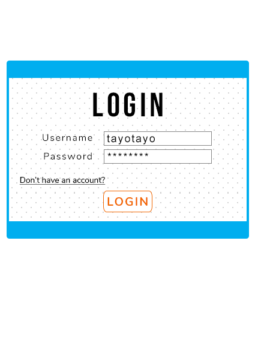
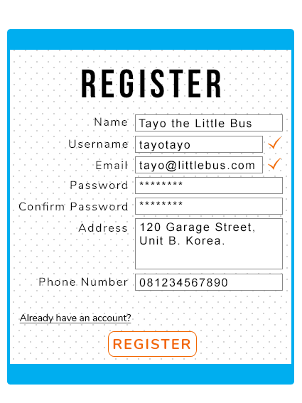
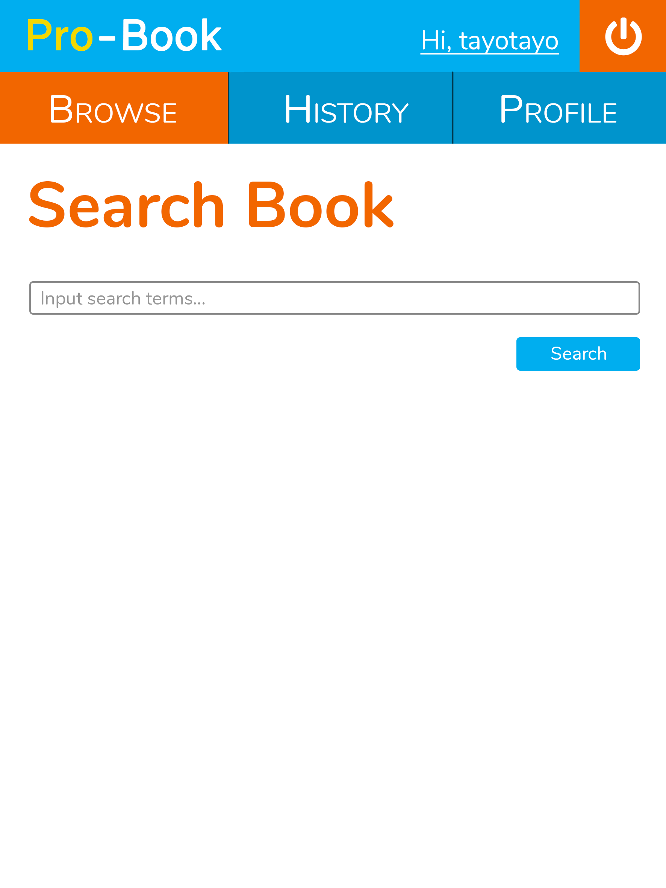
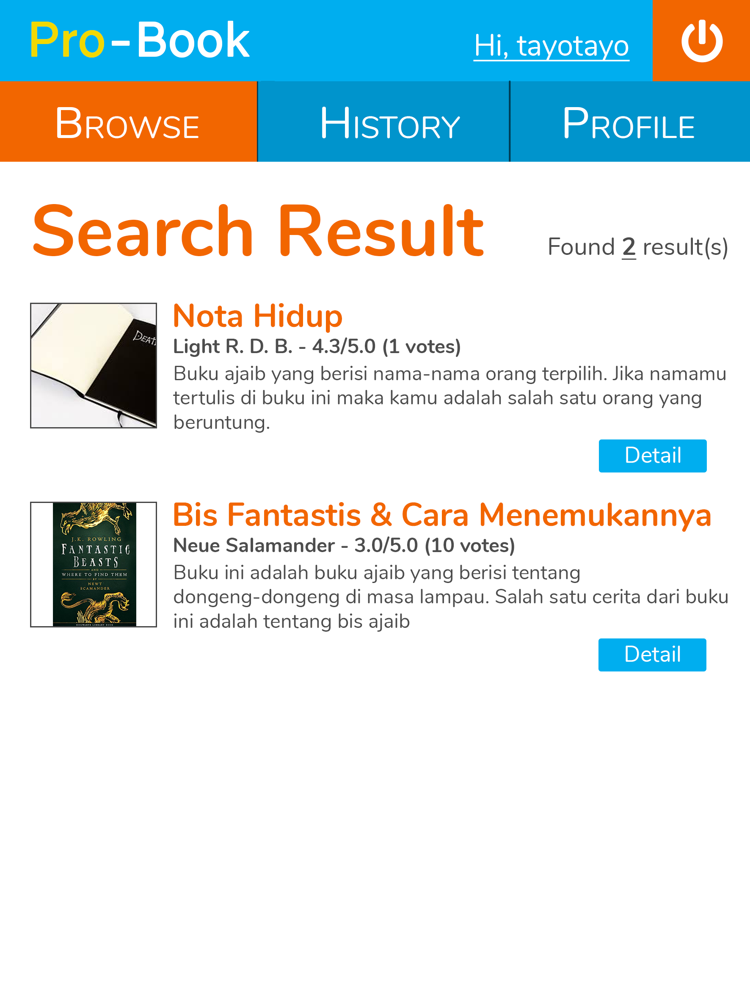
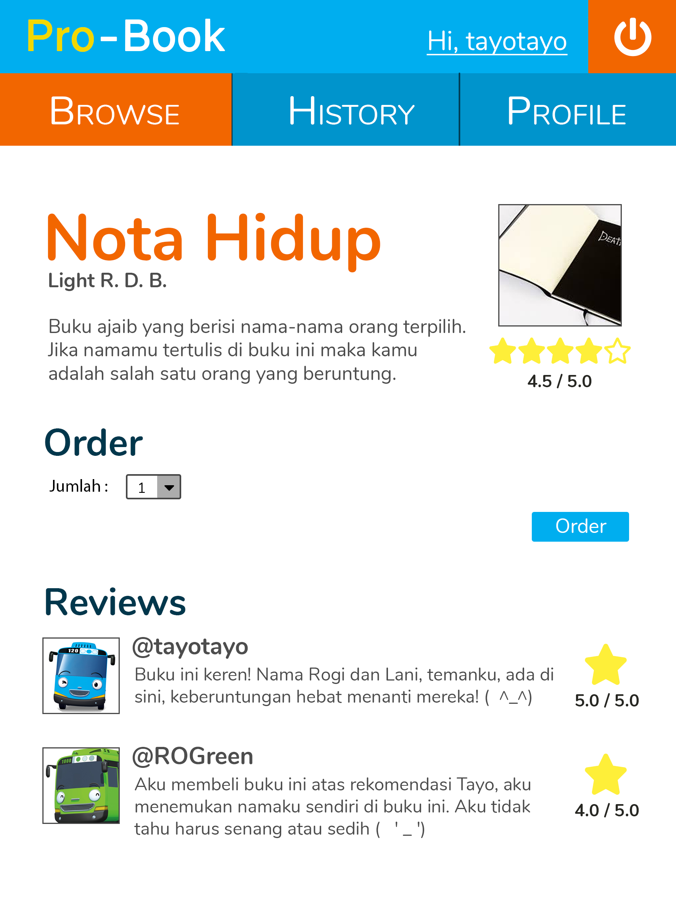
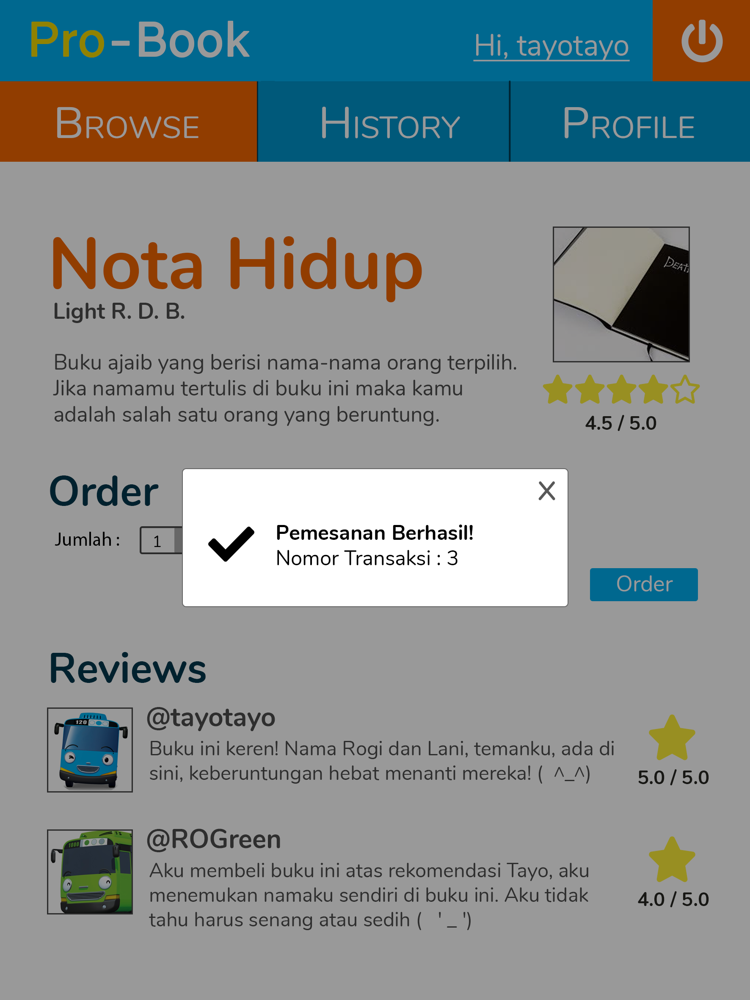
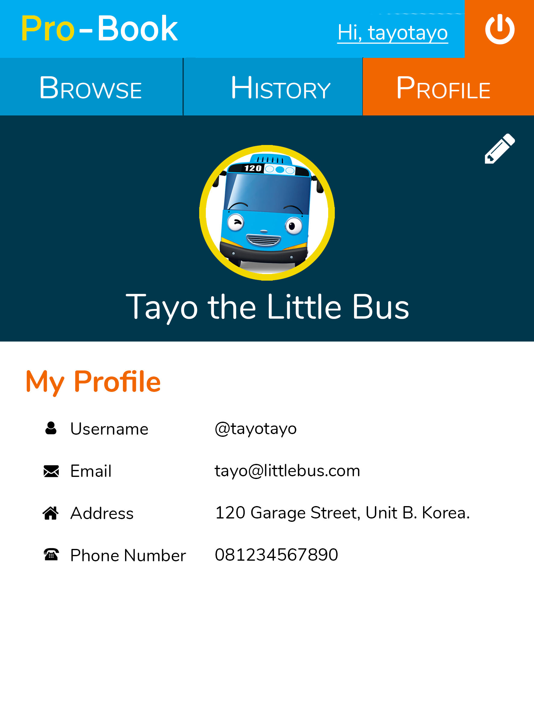
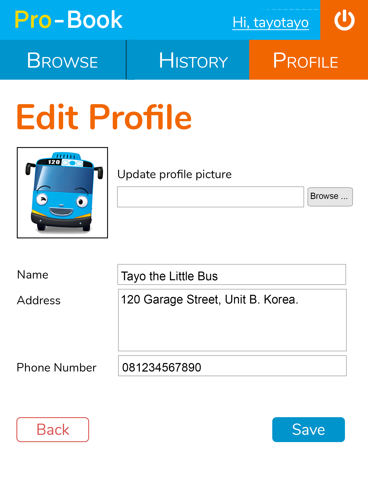
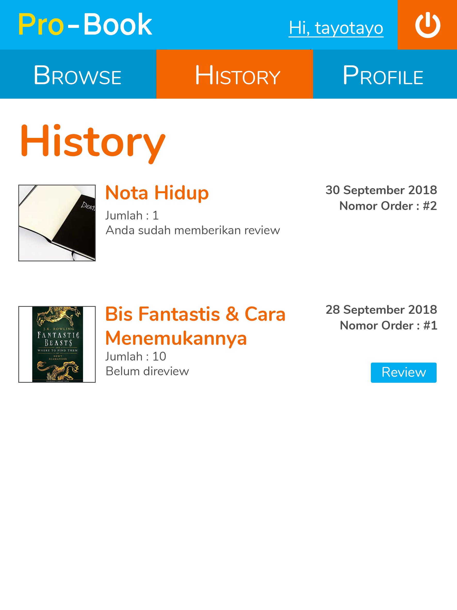
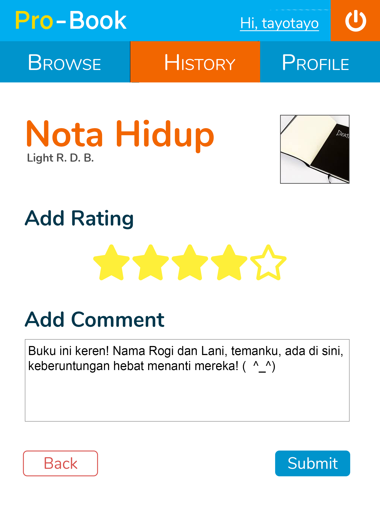

# Tugas 1 IF3110 Pengembangan Aplikasi Berbasis Web

Membuat sebuah Website Toko Buku
## Deskripsi Singkat

Pada tugas besar ini, Anda diminta untuk membuat aplikasi *toko buku online* **berbasis web** yang memungkinkan seorang pengguna untuk membeli dan memberi komentar pada buku. Untuk menggunakan aplikasi ini, seorang pengguna harus melakukan *login*. 

Anda diminta untuk membuat tampilan sedemikian hingga mirip dengan tampilan pada contoh. Website yang diminta tidak responsive. Desain tampilan tidak perlu dibuat indah. Icon dan jenis font tidak harus sama dengan contoh. Warna font, garis pemisah, dan perbedaan ukuran font harus terlihat sesuai contoh. Format rating dan waktu harus terlihat sesuai contoh. Perhatikan juga **tata letak** elemen-elemen.

## Anggota Tim

Setiap kelompok beranggotakan **3 orang dari kelas yang sama**. Jika jumlah mahasiswa dalam satu kelas modulo 3 menghasilkan 1, maka hanya 1 kelompok terdiri dari 4 mahasiswa. Jika jumlah mahasiswa modulo 3 menghasilkan 2, maka ada dua kelompok yang beranggotakan 4 orang.

## Petunjuk Pengerjaan

1. Buatlah organisasi pada gitlab dengan format "IF3110-2018-KXX-nama_kelompok", dengan XX adalah nomor kelas.
2. Tambahkan anggota tim pada organisasi anda.
3. Fork pada repository ini dengan organisasi yang telah dibuat.
4. Ubah hak akses repository hasil Fork anda menjadi **private**.
5. Silakan commit pada repository anda (hasil fork). Lakukan berberapa commit dengan pesan yang bermakna, contoh: `add register form`, `fix logout bug`, jangan seperti `final`, `benerin dikit`. Disarankan untuk tidak melakukan commit dengan perubahan yang besar karena akan mempengaruhi penilaian (contoh: hanya melakukan satu commit kemudian dikumpulkan). Sebaiknya commit dilakukan setiap ada penambahan fitur. **Commit dari setiap anggota tim akan mempengaruhi penilaian.** Jadi, setiap anggota tim harus melakukan commit yang berpengaruh terhadap proses pembuatan aplikasi.
6. Edit file readme ini semenarik mungkin (gunakan panduan Markdown language), diperbolehkan untuk merubah struktur dari readme ini. (Soal tidak perlu dipertahankan).
7. Pada Readme terdapat tampilan aplikasi, dokumentasi yang menjelaskan website yang Anda buat, dan penjelasan mengenai pembagian tugas masing-masing anggota (lihat formatnya pada bagian **pembagian tugas**).
8. Merge request dari repository anda ke repository ini dengan format **Nama kelompok** - **NIM terkecil** - **Nama Lengkap dengan NIM terkecil** sebelum **26 Oktober 2018 23.59**.

## Tools

1. Untuk backend, wajib menggunakan **PHP** tanpa framework apapun. Harap diperhatikan, Anda harus mengimplementasikan fitur menggunakan HTTP method yang tepat.
2. Gunakan **MySQL** untuk menyimpan data.
3. Untuk frontend, gunakan Javascript, HTML dan CSS. **Tidak boleh** menggunakan library atau framework CSS atau JS seperti JQuery atau Bootstrap. CSS sebisa mungkin ada di file yang berbeda dengan HTML (tidak inline styling).

## Spesifikasi

### Login

Pengguna dapat melakukan login sebagai user. Login hanya membandingkan username dan password saja, dan tidak perlu proteksi apapun. Identitas pengguna yang sudah login akan disimpan sebagai cookie dalam browser (misal cookie menyimpan id=2 menandakan bahwa pengguna dengan id 2 sudah login). Identitas tersebut tidak boleh disimpan sebagai parameter HTTP GET. Jika cookie ini tidak ada, maka pengguna dianggap belum login dan aplikasi akan selalu mengarahkan (*redirect*) pengguna ke halaman ini, meskipun pengguna membuka halaman yang lain. Masa berlaku cookie ditentukan sendiri oleh peserta.

**--Bonus--** 
Data yang disimpan pada cookie berupa `access token` yang dibangkitkan secara random dan memiliki `expiry time`. Jika `access token` ini tidak ada atau tidak valid, maka pengguna dianggap belum login. `Expiry time` sebuah `access token` berbeda dengan waktu berlaku cookie.

### Register

Pengguna dapat mendaftarkan diri sebagai user agar dapat menggunakan aplikasi ini. Pengguna tidak dapat mendaftarkan diri menggunakan email dan/atau username yang sudah pernah digunakan sebelumnya. **Validasi email dan username dilakukan menggunakan AJAX**. Jika email dan username valid akan ditandai dengan lambang centang seperti pada gambar. Setelah mendaftarkan diri, pengguna akan secara otomatis login dengan user yang baru didaftarkannya.

### Search-Books

Search-Books merupakan halaman utama yang ditampilkan ketika user telah login. Pada halaman Search-Books, terdapat sebuah input field dapat diisi pengguna untuk melakukan pencarian buku berdasarkan judul.

Setelah pengguna menekan tombol search, pengguna akan dibawa ke halaman Search-Result.

Perlu diperhatikan, pada bagian atas terdapat logo, tombol logout, dan tulisan dengan format "Hi, username". Selanjutnya, terdapat menu bar yang menampilkan 3 menu utama seperti pada gambar. Menu yang sedang dibuka diberikan warna background yang berbeda sebagai penanda halaman apa yang sedang dibuka pengguna.

### Search-Result

Pada Search-Result, ditampilkan daftar buku dan jumlah hasil pencarian. Pada tiap entri buku ditampilkan judul, penulis, gambar, potongan sinopsis, serta rating dari buku tersebut. Jika tombol detail ditekan, pengguna akan dibawa ke halaman Book-Detail dari buku yang bersangkutan.

### Book-Detail

Pada halaman ini, ditampilkan detail buku yang terdiri dari judul, penulis, gambar, rating, serta komentar dan rating dari user lain.

Pada halaman ini juga disediakan dropdown untuk memasukkan jumlah buku yang ingin dipesan dan tombol order. Jika tombol order ditekan, proses pemesanan akan dilakukan **menggunakan AJAX**, yang berarti halaman tidak akan di-*refresh* setelah tombol order ditekan. Tidak ada proses pembayaran yang ditangani oleh sistem.

Setelah proses pemesanan selesai dilakukan, akan muncul notifikasi pada browser pengguna. **Jangan menampilkan notifikasi setelah tombol order ditekan, tetapi setelah mendapat response dari AJAX**. Informasi yang diberikan oleh notifikasi mengikuti contoh.

**--Bonus--**
Tampilan notifikasi dibuat semirip mungkin dengan contoh.

### Profile

Pada halaman ini, ditampilkan nama lengkap, username, email, alamat, nomor telepon, dan foto profil. Pada bagian kanan atas terdapat tombol edit, jika pengguna menekan tombol tersebut, pengguna dibawa ke halaman Edit-Profile.

### Edit-Profile

Pada halaman ini, pengguna dapat mengubah nama yang ditampilkan, alamat, nomor telepon, dan foto profil.

Pada bagian bawah halaman, terdapat tombol Back dan Save. Jika tombol Back ditekan, pengguna kembali ke halaman Profile tanpa mengubah informasi profilnya. Jika tombol save ditekan, nama dan alamat pengguna akan diganti sesuai input field, dan pengguna dibawa ke halaman Profile.

### History

Pada halaman ini, ditampilkan daftar buku yang sudah pernah dipesan oleh pengguna, diurutkan berdasarkan waktu pemesanan dengan pesanan paling baru merupakan entri paling atas.

Pada tiap entri pada history, terdapat tombol review. Jika tombol review ditekan, pengguna akan dibawa ke halaman Review. Jika pengguna sudah memberikan review untuk order tersebut, tombol review akan hilang dari entri yang bersangkutan.

### Review

Pada halaman ini, pengguna dapat memberikan review untuk buku yang dipesan berupa rating dan komentar. Review yang diberikan dari halaman ini akan muncul pada halaman Book-Detail dari buku yang di-review. Setelah selesai, user akan dibawa kembali ke halaman History.

**--Bonus--**
Rating dibuat seperti contoh.

### Validasi

Validasi **wajib** dilakukan pada *client-side*, dengan menggunakan **javascript** bukan HTML 5 input type, yaitu:
- Setiap field pada form tidak boleh kosong. 
- Email harus sesuai format email.
- Jumlah buku yang dipesan minimal 1.
- Rating buku hanya boleh bernilai 1-5.
- Nama pengguna maksimal 20 karakter.
- Nomor telepon pengguna minimal 9 digit dan maksimal 12 digit.

## Knowledge

Untuk meringankan beban tugas ini, ada berberapa keyword yang bisa anda cari untuk menyelesaikan tugas ini.
- HTTP methods: get, post, put, delete
- CSS: margin, padding, header tag, font-size, text-align, float, clear, border, color, div, span, placeholder, anchor tag.
- Javascript : XMLHTTPRequest, alert.
- PHP: mysqli_connect, mysql_query, $_GET, $_POST, $_COOKIE, var_dump, print_r, echo, require, fungsi header.
- SQL query: SELECT, INSERT, UPDATE, DELETE, WHERE, operator LIKE.
Jika ada pertanyaan silakan tanyakan lewat milis.

### Pembagian Tugas
*Setiap anggota kelompok diwajibkan untuk mengerjakan bagian tampilan dan fungsionalitas.*

**Tampilan**
1. Login : 1351xxxx, 135xxxxx
2. Register : 135xxxxx
3. Lanjutkan ...

**Fungsionalitas**
1. Login : 135xxxxx, 135xxxxx
2. Register : 135xxxxx
3. Fungsionalitas : 135xxxxx,135xxxxx
4. Lanjutkan...

## About

Asisten IF3110 2018

Audry | Erick | Holy | Kevin J. | Tasya | Veren | Vincent H.

Dosen : Yudistira Dwi Wardhana | Riza Satria Perdana | Muhammad Zuhri Catur Candra

